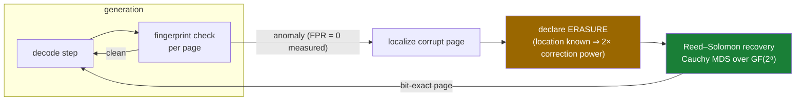
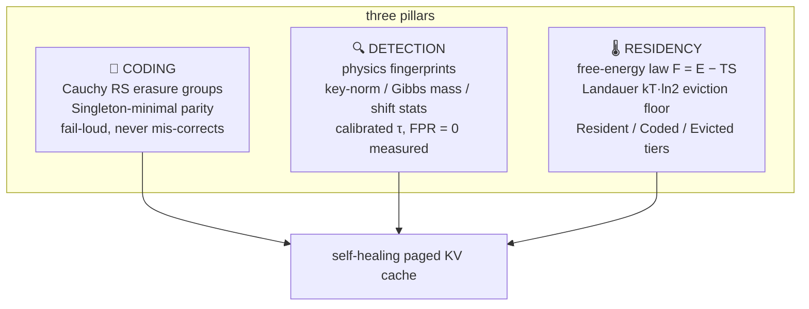

# AEPK-Paging — a Self-Healing KV Cache for Transformers

**The KV cache is treated as perfect memory. It isn't. This repo makes it heal itself.**

[]()
[]()
[]()
[]()
[]()

A paged transformer KV cache protected by Reed–Solomon parity, monitored by content-agnostic *physics fingerprints*, and able to repair silent corruption **bit-exactly, mid-generation, with zero recomputation** — demonstrated on real models, on a single consumer GPU (RTX 3050, 4 GB).

```
LIVE_HEAL: baseline_acc=0.000 aepk_acc=1.000 recovered=True decode_mode=erasure
```

A structured fault drives task accuracy from **1.0 → 0.0**. The fingerprint detector localizes the corrupt page, declares it an erasure, and Reed–Solomon recovery restores it byte-for-byte from parity. Generation continues. **2.4× faster than recomputing the prefix, at 25% storage overhead on protected pages.**

---

## How it works



The trick that pays for everything is **erasure conversion**. For the same parity budget, coding theory allows `2e + s ≤ 2t`: an error at an *unknown* location costs twice what a *located* erasure costs. A detector good enough to point at the corrupt page therefore **doubles the correction power of parity you already bought**. Nobody had wired this into a KV cache before.



---

## Headline results (every line quoted verbatim from a generated report)

| # | claim | verdict line | report |
|---|-------|-------------|--------|
| 1 | Live mid-generation heal, bit-exact, zero recompute | `LIVE_HEAL: baseline_acc=0.000 aepk_acc=1.000 recovered=True` | [`REPORT_phase10_liveheal.md`](results/REPORT_phase10_liveheal.md) |
| 2 | Page selection is load-bearing, not decorative | `HEAL_CONTROL: top_baseline=0.000 low_baseline=1.000 selection_load_bearing=True` | same |
| 3 | Heal beats recompute 2.4×, 25% overhead | `HEAL_COST: heal_ms=67.35 recompute_ms=164.24 ratio=2.44 parity_overhead_pct=25.00` | [`REPORT_phase10_healcost.md`](results/REPORT_phase10_healcost.md) |
| 4 | **The floor law: tolerance switches on at head_dim ≥ 128** | `FLOOR_LAW_GRID: verdict=H1` | [`REPORT_phase10_grid_v2.md`](results/REPORT_phase10_grid_v2.md) |
| 5 | The transition is sharp (threshold, not trend) | `TRANSITION: form=sharp (by head_dim, ΔAIC=8.1)` | same |
| 6 | Deployable detection works on persisted caches | `PERSIST_HEAL: detected=True healed_exact=True baseline_acc=0.000 healed_acc=1.000` | [`REPORT_phase10_persist.md`](results/REPORT_phase10_persist.md) |
| 7 | Parity encode hides behind decode (~14% per-token saving vs inline) | `ENCODE_ASYNC: sync_ms_per_tok=89.86 async_ms_per_tok=77.32 parity_bytes_exact=True` | [`REPORT_phase10_encodeasync.md`](results/REPORT_phase10_encodeasync.md) |
| 8 | 71–80% KV storage cut inside quality tolerance (≥1.5B models) | Phase 8 envelope | [`results/`](results/) |

### The redundancy-floor law

Seven models, three architecture families, pre-registered rival predictors — H1: `head_dim ≥ 128` vs H2: `KV-width ≥ 256`:

| model | head_dim | KV-width | retention | tolerant | discriminates? |
|-------|---------:|---------:|----------:|:--------:|:--------------:|
| qwen0.5b | 64 | 128 | 0.045 | ❌ | |
| **qwen1.5b** | **128** | 256 | **0.914** | ✅ | |
| tinyllama | 64 | 256 | 0.000 | ❌ | ⚔️ H2 said yes |
| pythia-410m | 64 | 1024 | 0.321 | ❌ | ⚔️ H2 said yes |
| **pythia-1b** | **256** | 2048 | **0.856** | ✅ | |
| **pythia-1.4b** | **128** | 2048 | **0.861** | ✅ | |
| smollm2-360m | 64 | 320 | 0.348 | ❌ | ⚔️ H2 said yes |

All three discriminating models break H1's way. The width law is dead; the head-dimension law stands, and the transition is **sharp** — a threshold, the shape of a law physics contributes and curve-fitting does not.

---

## The falsification ledger 💀

This project held its own ideas to a physics standard: **pre-register the prediction, then try to kill it.** Four physical claims went on trial. The kills are reported at the same prominence as the wins — that's the point.

| trial | claim | fate | the receipt |
|-------|-------|------|-------------|
| 1 | Thermodynamic parity allocation earns its formalism | 💀 **decorative** — a physics-free top-k reproduces it exactly | `BASELINE_PARITY: sets_identical=True` |
| 2 | Fluctuation–dissipation analogue (variance predicts damage) | 💀 **refuted** — after a positive-control redesign proved the system was actually perturbed | `FD: spearman=-0.1049 verdict=refuted` |
| 3 | Redundancy-floor law (head_dim ≥ 128) | ✅ **survived its powered kill-test** | `FLOOR_LAW_GRID: verdict=H1` |
| 4 | SNR mechanism *derived by this project for its own law* | 💀💀💀💀 **falsified on all four pre-registered predictions**, incl. a locked out-of-sample number (predicted 0.2056, measured <0.1) | `SNR_LAW: verdict=refuted` |

<details>
<summary><b>Trial 4 in one breath</b> (click)</summary>

We derived L_c = C·√(head_dim)·RMS_K from signal-to-noise geometry, measured every model's clean key magnitudes, **locked a numeric out-of-sample prediction in a timestamped pre-registration addendum before the GPU sweep launched**, and then watched all four predictions die: the predicted crossover missed (P1), the SNR score ranked worse than bare head_dim (P2), big-key layers took *more* damage, not less (P3), and under multiplicative noise the law *inverted* instead of purifying (P4). The floor law still stands — it was established on its own grid — but its mechanism is open. The wreckage points at outlier-channel geometry (layer 0 carries key RMS 68.9 vs 1.7 typical), which is future work, claimed as nothing more.

</details>

---

## The honesty spine 🔬

Every number in this repo was produced under mechanical discipline, not good intentions:

- **Pre-registration before every GPU run** — metric, seeds, thresholds, verdict format fixed in a `PREREG_*.md` *before* execution; amendments are versioned files, never edits
- **Everything runs twice** — result rows must match **byte-identically** (timing-only quantities get a pre-registered ±20% gate instead)
- **Verdict lines are runtime f-strings** — tests assert the line *exists*, never its values; no expected outcome lives in the test suite
- **Frozen core** — Phase 2–5 source must show a zero git diff at every later phase; no silent constant-tuning
- **Controls that can fail** — every control is mutation-tested: a deliberately broken implementation must make it fail
- **ALLOWED to FAIL** — every prereg names its falsifying outcome and commits to reporting it as the finding (see ledger above)

---

## Repro in three commands

```bash
pip install -r requirements.txt          # numpy, scipy, galois, pytest, hypothesis — pinned
python -m pytest -q                      # full CPU suite (no GPU, no network)
python -m aepk_paging.harness.phase10_liveheal   # the headline demo (needs CUDA, ~4GB, HF download)
```

Every experiment is a module under [`aepk_paging/harness/`](aepk_paging/harness/); every result under [`results/`](results/) pairs a `PREREG_*.md` (written first) with a `REPORT_*.md` (generated from measured rows) and byte-identical run dumps.

## Repo map

```
aepk_paging/
├── kv_page.py, page_table.py     # paged KV model, OS-style invariants
├── coding.py                     # Cauchy RS erasure groups + RS(255) — the restoring organ
├── detect.py                     # physics fingerprints + calibration
├── residency.py                  # free-energy tiering (F = E − TS, Landauer floor)
├── lossy_tier.py                 # quantization + corruption channels (frozen core)
└── harness/                      # every experiment, one module each
    ├── phase10_liveheal.py       #   live mid-generation heal
    ├── phase10_grid.py           #   the 7-model floor-law grid
    ├── phase10_healcost.py       #   microbenchmarks + async encode
    ├── phase10_snr.py            #   the mechanism that died honestly
    └── phase10_persist.py        #   persisted-cache save→corrupt→heal
tests/                            # 355+ CPU tests, line-exists only, no expected values
results/                          # PREREG + REPORT + byte-identical dumps per experiment
thesis/                           # the LaTeX manuscript
```

## Honest limits (before you ask)

Models ≤ 1.5B on one consumer GPU; curated probe sets; microbenchmarks, not serving throughput; no vLLM integration yet; the floor law is empirical — its mechanism is open (we killed our own candidate). The single most valuable next experiment: the same grid at 7B, including a big model with head_dim 64 (Falcon-7B), where the law predicts capability will *not* rescue a thin head.

## Why this exists

A personal thesis making one point: **physics matters for AI the way mathematics does** — not as vocabulary, but as laws (one survived) and as method (pre-registration, invariance, falsifiability — which produced every result here, the dead ones included).

*The cache checks its own physics. So does the repo.*
